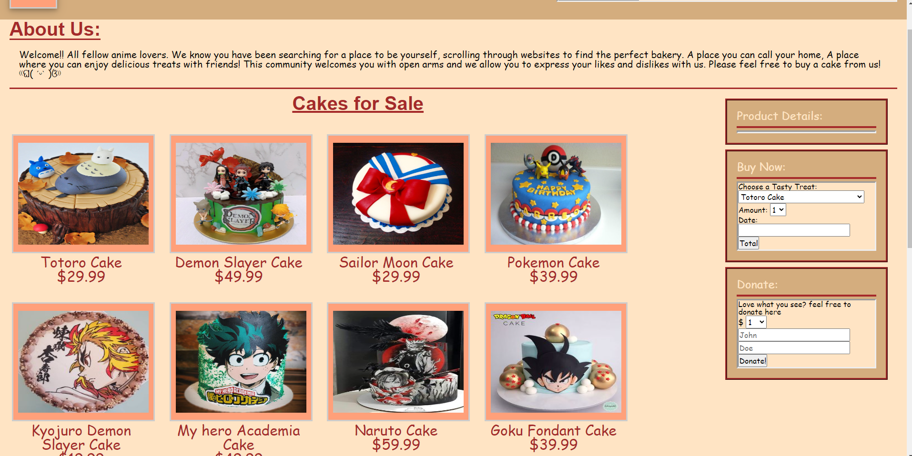

# Zess-T-repository Café Zest 
Project 1 for UoM: Café Zest

For this week we were tasked with our first group project. At the conclusion of each phase, we work as a group to create a project that solves a real world problem. Working together as a team, we aim to show off our classroom experiences and collaboratively build an application worth presenting.    

- The motivation behind this project was to collaboratively work together creating a project based around a café menu. The visual appeal of food is undeniable, and creating a website that a customer can view products and see their details is also key to standing out in the food industry. 
 
- We built this project to advance our skills working together as a team and further developing our coding skills for web development. 

- This project resolves around having products for a user to interact with and look at various details and purchase options offered by the café.Several key details about each product are shown such as details, a visual representation of the product and price. Furthermore, the customer can also "purchase" an item and buy in bulk.

- Completion of this project allowed for us to become more knowledgeable on third-party APIs and completion of an online cafe shop that keeps local storage elements for customers' orders.  

# Installation
In order to install our project, you will need the following

- Git
- IDE with HTML/CSS/JS capabilities 

To start: 
Clone the repository on GitHub then open Git on your local machine. First find a location of your choice on your computer that you want the folder to be in.
- To change working directory, use the command cd followed by a folder or cd.. to move back  
- Using the command git clone and adding the cloned directory, you will have a copy of this project
- To deploy to your ide type code. 

# Usage 
The purpose of this project is to make a functional webpage that uses server-side APIs to retrieve data based off of requests made to a url. With the data retrieved, we are able to display an updated menu and other various items. 

# Deployed Site 

https://wixkedluck.github.io/Zess-T-repository/ 
(Forked link because I am not the owner of this repository)

